# Data Model Documentation

This document describes the data model of the Quermed CRM as implemented in PostgreSQL 16 through SQLAlchemy models (`backend/app/infrastructure/db/models/`) and Alembic migrations (`backend/alembic/versions/`). It covers entity descriptions, field definitions, validation rules, relationships and an entity-relationship diagram.

Common conventions:

- Every table has a `id` UUID primary key (UUIDv7, generated by the application).
- Mutable aggregates carry `created_at`, `updated_at` (timestamptz, server defaults) and `version` (integer, starts at 1) for optimistic locking (`If-Match` header).
- Case-insensitive uniqueness uses the `citext` extension.
- Enumerations are PostgreSQL `ENUM` types named `<table>_<column>_enum`.

## Model Descriptions

### 1. User
A person who can log in: sales rep, sales manager, back office or administrator.

**Fields:**
- `id`: Unique identifier (Primary Key)
- `email`: Login identity, `citext`, unique (case-insensitive)
- `full_name`: Displayed as "Comercial" on records and reports
- `password_hash`: argon2id hash; null for future SSO-only users
- `role`: `users_role_enum` — `sales_rep | sales_manager | back_office | admin`
- `is_active`: Deactivated users cannot log in and their tokens are rejected (default `true`)
- `identity_provider`: `users_identity_provider_enum` — `password | entra_id` (default `password`)
- `external_id`: Identifier at the external identity provider (optional)
- `failed_login_attempts`: Consecutive failed logins (default 0)
- `locked_until`: Lockout expiry after 10 consecutive failures (optional)
- `version`, `created_at`, `updated_at`: Common columns

**Validation Rules:**
- Email must be a valid address; uniqueness is case-insensitive
- Password policy: at least 12 characters (enforced by the domain, only the hash is stored)
- An administrator cannot deactivate or demote their own account
- `(identity_provider, external_id)` is unique when `external_id` is set

**Relationships:**
- `territory_links`: One-to-many with UserTerritory (scope)
- `division_links`: One-to-many with UserDivision (scope)
- `refresh_tokens`: One-to-many with RefreshToken
- Referenced by AuditLog as `actor_id`

### 2. RefreshToken
A rotating refresh token issued at login; only its SHA-256 hash is stored.

**Fields:**
- `id`: Unique identifier (Primary Key)
- `user_id`: Foreign key to User (`ON DELETE RESTRICT`)
- `token_hash`: SHA-256 hex digest, unique (max 128 characters)
- `expires_at`: Expiry (30 days after issue)
- `used_at`: Set when rotated; reuse of a used token revokes the whole family
- `revoked_at`: Set on logout, password change, deactivation or reuse detection
- `replaced_by_id`: The token issued at rotation (self reference, `ON DELETE SET NULL`)
- `user_agent`, `ip`: Client information for support (optional, `inet` for `ip`)
- `created_at`: Issue time

**Validation Rules:**
- A token is usable only when `used_at` and `revoked_at` are null and `expires_at` is in the future

**Relationships:**
- `user`: Many-to-one with User
- `replaced_by`: Self reference to the successor token

### 3. Territory
A geographic sales territory made of Spanish provinces.

**Fields:**
- `id`: Unique identifier (Primary Key)
- `name`: `citext`, unique (case-insensitive), max 100 characters
- `is_active`: Inactive territories cannot be assigned (default `true`)
- `version`, `created_at`, `updated_at`: Common columns

**Validation Rules:**
- A territory with active users assigned cannot be deactivated (`territory_in_use`)

**Relationships:**
- `province_links`: One-to-many with TerritoryProvince (cascade delete)
- Referenced by UserTerritory

### 4. TerritoryProvince
Membership of a province in a territory.

**Fields:**
- `territory_id`: Foreign key to Territory (`ON DELETE CASCADE`), part of the primary key
- `province_code`: INE two-digit code `01`–`52`, part of the primary key

**Validation Rules:**
- `province_code` must match `^(0[1-9]|[1-4][0-9]|5[0-2])$` (check constraint)
- A province belongs to at most one territory (unique constraint on `province_code`) — this is what allows an account's province to resolve its territory automatically

**Relationships:**
- `territory`: Many-to-one with Territory

### 5. Division
Product division (reference data seeded by `app/infrastructure/db/seed.py`; seven rows with stable ids).

**Fields:**
- `id`: Unique identifier (Primary Key, deterministic UUIDv5 per code)
- `code`: `assisted_reproduction | consumables | gynaecology | vascular | neurology | equipment | carts_and_arms`, unique
- `name_es`: Spanish display name
- `sort_order`: Display order

**Relationships:**
- Referenced by UserDivision

### 6. UserTerritory
Assignment of a territory to a user (scope).

**Fields:**
- `user_id`: Foreign key to User (`ON DELETE CASCADE`), part of the primary key
- `territory_id`: Foreign key to Territory (`ON DELETE RESTRICT`), part of the primary key

### 7. UserDivision
Assignment of a division to a user (scope).

**Fields:**
- `user_id`: Foreign key to User (`ON DELETE CASCADE`), part of the primary key
- `division_id`: Foreign key to Division (`ON DELETE RESTRICT`), part of the primary key

### 8. AuditLog
Append-only record of every audited mutation.

**Fields:**
- `id`: Unique identifier (Primary Key)
- `occurred_at`: When the event happened
- `actor_id`: The user who acted (nullable for anonymous/system events, e.g. failed login for an unknown email)
- `entity_type`: `user`, `territory`, … 
- `entity_id`: The affected record (nullable)
- `action`: Dotted event name, e.g. `user.created`, `user.scope_changed`, `auth.login_failed`, `territory.updated`
- `changes`: `jsonb` map of `field → { before, after }`; `password_hash` and `token_hash` are always `"[redacted]"`
- `trace_id`: Request trace id for support

**Validation Rules:**
- Rows are never updated or deleted by the application; the `crm_app` database role has only `SELECT, INSERT` on this table
- Written in the same transaction as the data it describes (unit of work)

**Relationships:**
- `actor`: Many-to-one with User (no foreign key, so audit survives user changes)

### 9. AccountType
Type of customer centre (seed-only in the MVP).

**Fields:**
- `id`: Unique identifier (Primary Key, deterministic UUIDv5 per code)
- `code`: `ivf_clinic | public_hospital | private_hospital | private_practice | podiatry_center | distributor`, unique, immutable
- `name_es`: Spanish label
- `sort_order`: Dropdown order
- `buys_via_tender`: Public hospitals buy through tenders (defaults the tender stage later)
- `is_active`: Retire a value without a migration
- `created_at`, `updated_at`: Common columns

### 10. ActivityType
Kind of field activity (seed-only in the MVP).

**Fields:**
- `id`, `code` (`visit | call | email | demo | training | note`), `name_es`, `sort_order`, `is_active`, timestamps
- `icon`: lucide icon name for the timeline
- `counts_as_contact`: Notes do not count as customer contacts in activity reports

### 11. Brand
Manufacturer represented by Quermed (`is_own`) or a competitor.

**Fields:**
- `id`: Unique identifier (Primary Key)
- `code`: Unique, immutable, derived from the name (`cook_medical`, `three_gen`)
- `name`: `citext`, unique (case-insensitive), max 100 characters
- `is_own`: Own brand vs competitor
- `is_active`: Deactivation instead of deletion
- `version`, `created_at`, `updated_at`: Common columns

**Relationships:**
- `division_links`: One-to-many with BrandDivision (divisions the brand belongs to; empty until the catalogue change)

### 12. BrandDivision
Membership of a brand in a division.

**Fields:**
- `brand_id`: Foreign key to Brand (`ON DELETE CASCADE`), part of the primary key
- `division_id`: Foreign key to Division (`ON DELETE RESTRICT`), part of the primary key

### 13. LossReason
Why an opportunity was lost (mandatory when closing as lost).

**Fields:**
- `id`, `code` (unique), `name_es` (`citext`, unique), `sort_order`, `is_active`, `version`, timestamps
- `requires_brand`: "Competidor" demands the competing brand
- `requires_note`: "Otro" demands a free-text note

**Validation Rules:**
- `requires_brand` / `requires_note` are semantic flags refreshed by the seed and not editable through the API

### 14. Pipeline
Sales process: `equipment` (Equipos) or `consumables` (Consumibles).

**Fields:**
- `id`, `code` (unique), `name_es` (`citext`, unique), `sort_order`, `version`, timestamps

**Relationships:**
- `division_links`: One-to-many with PipelineDivision (default pipeline per division)
- `stages`: One-to-many with PipelineStage, ordered by `sort_order`

### 15. PipelineDivision
Default pipeline of a division.

**Fields:**
- `pipeline_id`: Foreign key to Pipeline (`ON DELETE CASCADE`), part of the primary key
- `division_id`: Foreign key to Division (`ON DELETE RESTRICT`), part of the primary key, **unique** (one default pipeline per division)

### 16. PipelineStage
Ordered stage of a pipeline.

**Fields:**
- `id`: Unique identifier (Primary Key)
- `pipeline_id`: Foreign key to Pipeline (`ON DELETE RESTRICT`)
- `code`: Unique per pipeline, immutable
- `name_es`: Editable label
- `sort_order`: Position, unique per pipeline (deferrable constraint so reorders swap inside one transaction)
- `probability`: 0-100 (check constraint), used for the weighted forecast
- `is_won`, `is_lost`, `is_at_risk`: Semantic flags (never both won and lost, immutable through the API)
- `is_active`: A pipeline must keep at least one active open stage
- `version`, `created_at`, `updated_at`: Common columns

### 17. Account
A customer centre ("centro"): clinic, hospital, laboratory or distributor. The scoped record of the territory visibility rule.

**Fields:**
- `id`: Unique identifier (Primary Key)
- `name`: Required, searched with a trigram index
- `account_type_id`: Foreign key to AccountType (`ON DELETE RESTRICT`)
- `province_code`: Primary address province (INE code, check constraint); derives the territory on creation
- `street`, `postal_code` (5 digits), `city`: Primary address (optional)
- `tax_id`: Spanish NIF/CIF/NIE, normalised, unique when present (partial index)
- `customer_code`: Sage customer reference
- `phone` (E.164), `email` (citext), `website`, `notes`: Optional
- `territory_id`: Foreign key to Territory (`ON DELETE SET NULL`); nullable, set from the province and editable by managers
- `owner_id`: Foreign key to User (`ON DELETE SET NULL`); nullable ("sin comercial")
- `last_contact_at`, `next_activity_at`: Denormalised from activities (max done contact-counting activity, min planned); recomputed by the activity service after every command, never written through the API
- `is_active`, `version`, `created_at`, `updated_at`: Common columns

### 18. AccountAddress
Additional labelled address of an account (max 10 per account, enforced by the domain).

**Fields:**
- `id`: Unique identifier (Primary Key)
- `account_id`: Foreign key to Account (`ON DELETE CASCADE`)
- `label`: citext, unique per account
- `street`, `postal_code` (5 digits), `city`, `province_code` (check constraint), `notes`

### 19. AccountDivision
Divisions of interest of an account (many-to-many). An account without rows is visible to every rep of its territory.

**Fields:**
- `account_id`: Foreign key to Account (`ON DELETE CASCADE`), part of the primary key
- `division_id`: Foreign key to Division (`ON DELETE RESTRICT`), part of the primary key, indexed (scope predicate)

### 20. AccountBrand
Brands (own or competitor) an account already uses.

**Fields:**
- `account_id`: Foreign key to Account (`ON DELETE CASCADE`), part of the primary key
- `brand_id`: Foreign key to Brand (`ON DELETE RESTRICT`), part of the primary key

### 21. JobTitle
Admin-editable master of contact job titles ("cargos"), seeded with eleven values.

**Fields:**
- `id`: Unique identifier (Primary Key, deterministic for seeded rows)
- `code`: Unique, immutable
- `name_es`: Unique (citext), editable
- `sort_order`, `is_active`, `version`, `created_at`, `updated_at`

### 22. Contact
A person at an account. Visibility follows the account.

**Fields:**
- `id`: Unique identifier (Primary Key)
- `account_id`: Foreign key to Account (`ON DELETE RESTRICT`)
- `first_name`, `last_name`: Required
- `job_title_id`: Foreign key to JobTitle (`ON DELETE RESTRICT`), optional
- `division_id`: Speciality, foreign key to Division (`ON DELETE RESTRICT`), optional
- `email` (citext), `mobile`, `landline` (E.164), `notes`: Optional
- `preferred_channel`: `contacts_preferred_channel_enum` (`email`, `mobile`, `landline`); check constraint requires the matching field
- `is_primary`: At most one per account (partial unique index)
- `is_active`: Deactivation instead of deletion
- `consent_status`: `contacts_consent_status_enum` (`unknown`, `granted`, `denied`), default `unknown`
- `consent_at`, `consent_source` (`contacts_consent_source_enum`: `verbal`, `email`, `form`, `imported`), `consent_recorded_by` (FK User, `ON DELETE SET NULL`): required together when the status is known (check constraint)
- `anonymised_at`: Set by the GDPR erasure; anonymised contacts are read-only
- `version`, `created_at`, `updated_at`: Common columns

### 23. PersonalDataAccessLog
Append-only record of who read a contact's personal data (GDPR accountability). Written only for readers who are not the account owner, a sales manager or an admin.

**Fields:**
- `id`: Unique identifier (Primary Key)
- `occurred_at`: Timestamp (server default)
- `user_id`: Foreign key to User (`ON DELETE RESTRICT`)
- `contact_id`: Foreign key to Contact (`ON DELETE RESTRICT`)
- `trace_id`: Request trace id

### 24. Activity
One interaction with a centre: visit, call, email, demo, training or note. Planned activities feed "Hoy"; done ones feed the timeline and `accounts.last_contact_at`.

**Fields:**
- `id`: Unique identifier (Primary Key)
- `account_id`: Foreign key to Account (`ON DELETE RESTRICT`)
- `activity_type_id`: Foreign key to ActivityType (`ON DELETE RESTRICT`); `counts_as_contact` decides whether it updates `last_contact_at`, notes cannot be planned
- `owner_id`, `created_by`: Foreign keys to User (`ON DELETE RESTRICT`)
- `status`: `activities_status_enum` (`planned`, `done`, `cancelled`); `done` and `cancelled` are terminal
- `scheduled_at`: When it happens or happened; `done_at`: when it was closed (check: required when done)
- `duration_minutes`: 1–1440 (check)
- `outcome`: `activities_outcome_enum` (`positive`, `neutral`, `negative`, `no_contact`), only when done (check)
- `subject` (≤ 120), `notes`, `cancel_reason` (check: required when cancelled)
- `version`, `created_at`, `updated_at`: Common columns

### 25. ActivityContact
Participating contacts of an activity (must belong to the same account, enforced by the service).

**Fields:**
- `activity_id`: Foreign key to Activity (`ON DELETE CASCADE`), part of the primary key
- `contact_id`: Foreign key to Contact (`ON DELETE RESTRICT`), part of the primary key

## Entity Relationship Diagram

```mermaid
erDiagram
    users {
        UUID id PK
        citext email UK
        text full_name
        text password_hash
        users_role_enum role
        boolean is_active
        users_identity_provider_enum identity_provider
        text external_id
        int failed_login_attempts
        timestamptz locked_until
        int version
        timestamptz created_at
        timestamptz updated_at
    }
    refresh_tokens {
        UUID id PK
        UUID user_id FK
        varchar token_hash UK
        timestamptz expires_at
        timestamptz used_at
        timestamptz revoked_at
        UUID replaced_by_id FK
        text user_agent
        inet ip
        timestamptz created_at
    }
    territories {
        UUID id PK
        citext name UK
        boolean is_active
        int version
        timestamptz created_at
        timestamptz updated_at
    }
    territory_provinces {
        UUID territory_id PK, FK
        char2 province_code PK, UK
    }
    divisions {
        UUID id PK
        text code UK
        text name_es
        int sort_order
    }
    user_territories {
        UUID user_id PK, FK
        UUID territory_id PK, FK
    }
    user_divisions {
        UUID user_id PK, FK
        UUID division_id PK, FK
    }
    audit_log {
        UUID id PK
        timestamptz occurred_at
        UUID actor_id
        text entity_type
        UUID entity_id
        text action
        jsonb changes
        text trace_id
    }

    users ||--o{ refresh_tokens : "issues"
    refresh_tokens |o--o| refresh_tokens : "replaced_by"
    users ||--o{ user_territories : "scoped to"
    territories ||--o{ user_territories : "assigned to"
    users ||--o{ user_divisions : "scoped to"
    divisions ||--o{ user_divisions : "assigned to"
    territories ||--o{ territory_provinces : "covers"
    users ||--o{ audit_log : "acts (actor_id)"

    account_types {
        UUID id PK
        text code UK
        text name_es
        int sort_order
        boolean buys_via_tender
        boolean is_active
    }
    activity_types {
        UUID id PK
        text code UK
        text name_es
        int sort_order
        text icon
        boolean counts_as_contact
        boolean is_active
    }
    brands {
        UUID id PK
        text code UK
        citext name UK
        boolean is_own
        boolean is_active
        int version
    }
    brand_divisions {
        UUID brand_id PK, FK
        UUID division_id PK, FK
    }
    loss_reasons {
        UUID id PK
        text code UK
        citext name_es UK
        int sort_order
        boolean requires_brand
        boolean requires_note
        boolean is_active
        int version
    }
    pipelines {
        UUID id PK
        text code UK
        citext name_es UK
        int sort_order
        int version
    }
    pipeline_divisions {
        UUID pipeline_id PK, FK
        UUID division_id PK, FK, UK
    }
    pipeline_stages {
        UUID id PK
        UUID pipeline_id FK
        text code
        text name_es
        int sort_order
        smallint probability
        boolean is_won
        boolean is_lost
        boolean is_at_risk
        boolean is_active
        int version
    }

    accounts {
        UUID id PK
        text name
        UUID account_type_id FK
        char2 province_code
        text street
        varchar5 postal_code
        text city
        text tax_id UK
        text customer_code
        text phone
        citext email
        text website
        text notes
        UUID territory_id FK
        UUID owner_id FK
        boolean is_active
        int version
    }
    account_addresses {
        UUID id PK
        UUID account_id FK
        citext label
        text street
        varchar5 postal_code
        text city
        char2 province_code
        text notes
    }
    account_divisions {
        UUID account_id PK, FK
        UUID division_id PK, FK
    }
    account_brands {
        UUID account_id PK, FK
        UUID brand_id PK, FK
    }
    job_titles {
        UUID id PK
        text code UK
        citext name_es UK
        int sort_order
        boolean is_active
        int version
    }
    contacts {
        UUID id PK
        UUID account_id FK
        text first_name
        text last_name
        UUID job_title_id FK
        UUID division_id FK
        citext email
        text mobile
        text landline
        contacts_preferred_channel_enum preferred_channel
        text notes
        boolean is_primary
        boolean is_active
        contacts_consent_status_enum consent_status
        timestamptz consent_at
        contacts_consent_source_enum consent_source
        UUID consent_recorded_by FK
        timestamptz anonymised_at
        int version
    }
    activities {
        UUID id PK
        UUID account_id FK
        UUID activity_type_id FK
        UUID owner_id FK
        UUID created_by FK
        activities_status_enum status
        timestamptz scheduled_at
        timestamptz done_at
        smallint duration_minutes
        activities_outcome_enum outcome
        text subject
        text notes
        text cancel_reason
        int version
    }
    activity_contacts {
        UUID activity_id PK, FK
        UUID contact_id PK, FK
    }
    personal_data_access_log {
        UUID id PK
        timestamptz occurred_at
        UUID user_id FK
        UUID contact_id FK
        text trace_id
    }

    brands ||--o{ brand_divisions : "belongs to"
    divisions ||--o{ brand_divisions : "groups"
    pipelines ||--o{ pipeline_divisions : "default for"
    divisions ||--o| pipeline_divisions : "has default"
    pipelines ||--o{ pipeline_stages : "orders"
    account_types ||--o{ accounts : "classifies"
    territories |o--o{ accounts : "covers"
    users |o--o{ accounts : "owns"
    accounts ||--o{ account_addresses : "has"
    accounts ||--o{ account_divisions : "interested in"
    divisions ||--o{ account_divisions : "groups"
    accounts ||--o{ account_brands : "uses"
    brands ||--o{ account_brands : "used by"
    accounts ||--o{ contacts : "employs"
    job_titles |o--o{ contacts : "titles"
    divisions |o--o{ contacts : "speciality"
    users |o--o{ contacts : "recorded consent"
    contacts ||--o{ personal_data_access_log : "read"
    users ||--o{ personal_data_access_log : "reads"
    accounts ||--o{ activities : "timeline"
    activity_types ||--o{ activities : "classifies"
    users ||--o{ activities : "owns"
    activities ||--o{ activity_contacts : "with"
    contacts ||--o{ activity_contacts : "participates"
```

## Indexes

| Table | Index | Purpose |
|---|---|---|
| `users` | `users_email_key` (unique), `ix_users_role`, `ix_users_is_active`, `uq_users_provider_external_id` | login lookup, list filters, SSO identity |
| `refresh_tokens` | `refresh_tokens_token_hash_key` (unique), `ix_refresh_tokens_user_id`, `ix_refresh_tokens_expires_at` | token lookup, revocation per user, expiry cleanup |
| `territories` | `territories_name_key` (unique) | name uniqueness |
| `territory_provinces` | PK `(territory_id, province_code)`, `uq_territory_provinces_province_code` | one territory per province |
| `audit_log` | `ix_audit_log_entity (entity_type, entity_id, occurred_at DESC)`, `ix_audit_log_actor (actor_id, occurred_at DESC)`, `ix_audit_log_occurred_at (occurred_at DESC)` | audit timeline per entity/actor |
| `brands` | `brands_code_key`, `brands_name_key` (unique), `ix_brands_is_own`, `ix_brands_is_active` | lookups and list filters |
| `loss_reasons`, `pipelines`, `account_types`, `activity_types` | unique `code` (+ unique name where editable) | stable references |
| `pipeline_divisions` | `uq_pipeline_divisions_division_id` | one default pipeline per division |
| `pipeline_stages` | `uq_pipeline_stages_code (pipeline_id, code)`, `uq_pipeline_stages_sort_order (pipeline_id, sort_order)` deferrable, checks `ck_pipeline_stages_probability`, `ck_pipeline_stages_won_lost` | ordering and invariants |
| `accounts` | `ix_accounts_name_trgm`, `ix_accounts_city_trgm` (GIN, `pg_trgm`), `ux_accounts_tax_id` (partial unique), `ix_accounts_customer_code`, `ix_accounts_territory_id`, `ix_accounts_owner_id`, `ix_accounts_account_type_id`, `ix_accounts_province_code`, `ix_accounts_is_active`, checks on province and postal code | list search under 500 ms, scope predicate, duplicate CIF |
| `account_addresses` | `uq_account_addresses_label (account_id, label)`, `ix_account_addresses_account_id` | label uniqueness |
| `account_divisions` | PK `(account_id, division_id)`, `ix_account_divisions_division_id` | scope predicate |
| `job_titles` | `job_titles_code_key`, `job_titles_name_es_key` (unique) | stable references |
| `contacts` | `ux_contacts_primary_per_account (account_id) WHERE is_primary`, `ix_contacts_account_id`, `ix_contacts_email`, checks `ck_contacts_consent_complete`, `ck_contacts_preferred_channel_value` | one primary contact, consent evidence |
| `personal_data_access_log` | `ix_personal_data_access_contact (contact_id, occurred_at DESC)`, `ix_personal_data_access_user (user_id, occurred_at DESC)` | GDPR access history |
| `activities` | `ix_activities_account_timeline (account_id, scheduled_at DESC)`, `ix_activities_owner_agenda (owner_id, status, scheduled_at)`, `ix_activities_activity_type_id`, `ix_activities_status`, checks `ck_activities_done_requires_done_at`, `ck_activities_cancelled_requires_reason`, `ck_activities_outcome_done`, `ck_activities_duration_range` | account timeline, "Hoy" and overdue, lifecycle invariants |
| `accounts` (+) | `ix_accounts_territory_last_contact (territory_id, last_contact_at)` | "centros sin visitar" alerts |

## Key Design Principles

1. **Scope is data**: territories (provinces) and divisions are assigned to users; later changes filter business records with the same scope at SQL level.
2. **Optimistic locking**: every mutable aggregate carries `version`; concurrent edits fail with `409` instead of silently overwriting.
3. **Audit in the same transaction**: audit rows and data changes commit together; the table is append-only for the application role.
4. **Provinces are code, not a table**: the 52 INE codes never change; a check constraint keeps the column honest.
5. **Reference data with stable ids**: divisions are seeded with deterministic UUIDs so environments never drift.
6. **The account is the scoped record**: visibility is decided on `accounts` (owner, territory, divisions of interest) both in Python (`VisibilityPolicy`) and as one SQL predicate (`ScopeFilter`); contacts inherit it.
7. **Activity summary is recomputed, never incremented**: `last_contact_at` / `next_activity_at` are rebuilt from the activities after every command so they cannot drift.
8. **Personal data is erased, never deleted**: anonymisation keeps the row (history stays attached) and the audit log never stores the cleared values.

## Notes

- Migration `0001_foundation` (`backend/alembic/versions/20260827_2101_foundation.py`) creates the extension, enums, tables, indexes and the guarded grant on `audit_log`.
- Migration `0002_reference_data` (`backend/alembic/versions/20260828_0701_reference_data.py`) creates the reference data tables. The seed upserts masters by `code`; admin-editable columns (names, probabilities, order, active flag, links) are written only on insert, semantic flags are refreshed.
- Migration `0003_accounts_contacts` (`backend/alembic/versions/20260828_0816_accounts_contacts.py`) creates the `pg_trgm` extension, the account/contact tables, the contact enums and the append-only grant on `personal_data_access_log`. The seed adds the eleven job titles (insert-only, admin edits survive).
- Migration `0004_activities` (`backend/alembic/versions/20260828_1004_activities.py`) creates `activities`, `activity_contacts`, the two enums, the summary columns on `accounts` and the guarded `crm_app` grants.
- The application role `crm_app` is created by the seed (`make seed`); in development the superuser `crm` from Docker Compose is used and the audit grant is only applied when the role exists.
