# Data Model Documentation

This document describes the data model of the Quermed CRM as implemented in PostgreSQL 16 through SQLAlchemy models (`backend/app/infrastructure/db/models/`) and Alembic migrations (`backend/alembic/versions/`). It covers entity descriptions, field definitions, validation rules, relationships and an entity-relationship diagram.

Common conventions:

- Every table has a `id` UUID primary key (UUIDv7, generated by the application).
- Mutable aggregates carry `created_at`, `updated_at` (timestamptz, server defaults) and `version` (integer, starts at 1) for optimistic locking (`If-Match` header).
- Case-insensitive uniqueness uses the `citext` extension.
- Enumerations are PostgreSQL `ENUM` types named `<table>_<column>_enum`.

## Model Descriptions

### 1. User
A person who can log in: sales rep, sales manager, back office or administrator.

**Fields:**
- `id`: Unique identifier (Primary Key)
- `email`: Login identity, `citext`, unique (case-insensitive)
- `full_name`: Displayed as "Comercial" on records and reports
- `password_hash`: argon2id hash; null for future SSO-only users
- `role`: `users_role_enum` — `sales_rep | sales_manager | back_office | admin`
- `is_active`: Deactivated users cannot log in and their tokens are rejected (default `true`)
- `identity_provider`: `users_identity_provider_enum` — `password | entra_id` (default `password`)
- `external_id`: Identifier at the external identity provider (optional)
- `failed_login_attempts`: Consecutive failed logins (default 0)
- `locked_until`: Lockout expiry after 10 consecutive failures (optional)
- `version`, `created_at`, `updated_at`: Common columns

**Validation Rules:**
- Email must be a valid address; uniqueness is case-insensitive
- Password policy: at least 12 characters (enforced by the domain, only the hash is stored)
- An administrator cannot deactivate or demote their own account
- `(identity_provider, external_id)` is unique when `external_id` is set

**Relationships:**
- `territory_links`: One-to-many with UserTerritory (scope)
- `division_links`: One-to-many with UserDivision (scope)
- `refresh_tokens`: One-to-many with RefreshToken
- Referenced by AuditLog as `actor_id`

### 2. RefreshToken
A rotating refresh token issued at login; only its SHA-256 hash is stored.

**Fields:**
- `id`: Unique identifier (Primary Key)
- `user_id`: Foreign key to User (`ON DELETE RESTRICT`)
- `token_hash`: SHA-256 hex digest, unique (max 128 characters)
- `expires_at`: Expiry (30 days after issue)
- `used_at`: Set when rotated; reuse of a used token revokes the whole family
- `revoked_at`: Set on logout, password change, deactivation or reuse detection
- `replaced_by_id`: The token issued at rotation (self reference, `ON DELETE SET NULL`)
- `user_agent`, `ip`: Client information for support (optional, `inet` for `ip`)
- `created_at`: Issue time

**Validation Rules:**
- A token is usable only when `used_at` and `revoked_at` are null and `expires_at` is in the future

**Relationships:**
- `user`: Many-to-one with User
- `replaced_by`: Self reference to the successor token

### 3. Territory
A geographic sales territory made of Spanish provinces.

**Fields:**
- `id`: Unique identifier (Primary Key)
- `name`: `citext`, unique (case-insensitive), max 100 characters
- `is_active`: Inactive territories cannot be assigned (default `true`)
- `version`, `created_at`, `updated_at`: Common columns

**Validation Rules:**
- A territory with active users assigned cannot be deactivated (`territory_in_use`)

**Relationships:**
- `province_links`: One-to-many with TerritoryProvince (cascade delete)
- Referenced by UserTerritory

### 4. TerritoryProvince
Membership of a province in a territory.

**Fields:**
- `territory_id`: Foreign key to Territory (`ON DELETE CASCADE`), part of the primary key
- `province_code`: INE two-digit code `01`–`52`, part of the primary key

**Validation Rules:**
- `province_code` must match `^(0[1-9]|[1-4][0-9]|5[0-2])$` (check constraint)
- A province belongs to at most one territory (unique constraint on `province_code`) — this is what allows an account's province to resolve its territory automatically

**Relationships:**
- `territory`: Many-to-one with Territory

### 5. Division
Product division (reference data seeded by `app/infrastructure/db/seed.py`; seven rows with stable ids).

**Fields:**
- `id`: Unique identifier (Primary Key, deterministic UUIDv5 per code)
- `code`: `assisted_reproduction | consumables | gynaecology | vascular | neurology | equipment | carts_and_arms`, unique
- `name_es`: Spanish display name
- `sort_order`: Display order

**Relationships:**
- Referenced by UserDivision

### 6. UserTerritory
Assignment of a territory to a user (scope).

**Fields:**
- `user_id`: Foreign key to User (`ON DELETE CASCADE`), part of the primary key
- `territory_id`: Foreign key to Territory (`ON DELETE RESTRICT`), part of the primary key

### 7. UserDivision
Assignment of a division to a user (scope).

**Fields:**
- `user_id`: Foreign key to User (`ON DELETE CASCADE`), part of the primary key
- `division_id`: Foreign key to Division (`ON DELETE RESTRICT`), part of the primary key

### 8. AuditLog
Append-only record of every audited mutation.

**Fields:**
- `id`: Unique identifier (Primary Key)
- `occurred_at`: When the event happened
- `actor_id`: The user who acted (nullable for anonymous/system events, e.g. failed login for an unknown email)
- `entity_type`: `user`, `territory`, … 
- `entity_id`: The affected record (nullable)
- `action`: Dotted event name, e.g. `user.created`, `user.scope_changed`, `auth.login_failed`, `territory.updated`
- `changes`: `jsonb` map of `field → { before, after }`; `password_hash` and `token_hash` are always `"[redacted]"`
- `trace_id`: Request trace id for support

**Validation Rules:**
- Rows are never updated or deleted by the application; the `crm_app` database role has only `SELECT, INSERT` on this table
- Written in the same transaction as the data it describes (unit of work)

**Relationships:**
- `actor`: Many-to-one with User (no foreign key, so audit survives user changes)

### 9. AccountType
Type of customer centre (seed-only in the MVP).

**Fields:**
- `id`: Unique identifier (Primary Key, deterministic UUIDv5 per code)
- `code`: `ivf_clinic | public_hospital | private_hospital | private_practice | podiatry_center | distributor`, unique, immutable
- `name_es`: Spanish label
- `sort_order`: Dropdown order
- `buys_via_tender`: Public hospitals buy through tenders (defaults the tender stage later)
- `is_active`: Retire a value without a migration
- `created_at`, `updated_at`: Common columns

### 10. ActivityType
Kind of field activity (seed-only in the MVP).

**Fields:**
- `id`, `code` (`visit | call | email | demo | training | note`), `name_es`, `sort_order`, `is_active`, timestamps
- `icon`: lucide icon name for the timeline
- `counts_as_contact`: Notes do not count as customer contacts in activity reports

### 11. Brand
Manufacturer represented by Quermed (`is_own`) or a competitor.

**Fields:**
- `id`: Unique identifier (Primary Key)
- `code`: Unique, immutable, derived from the name (`cook_medical`, `three_gen`)
- `name`: `citext`, unique (case-insensitive), max 100 characters
- `is_own`: Own brand vs competitor
- `is_active`: Deactivation instead of deletion
- `version`, `created_at`, `updated_at`: Common columns

**Relationships:**
- `division_links`: One-to-many with BrandDivision (divisions the brand belongs to; empty until the catalogue change)

### 12. BrandDivision
Membership of a brand in a division.

**Fields:**
- `brand_id`: Foreign key to Brand (`ON DELETE CASCADE`), part of the primary key
- `division_id`: Foreign key to Division (`ON DELETE RESTRICT`), part of the primary key

### 13. LossReason
Why an opportunity was lost (mandatory when closing as lost).

**Fields:**
- `id`, `code` (unique), `name_es` (`citext`, unique), `sort_order`, `is_active`, `version`, timestamps
- `requires_brand`: "Competidor" demands the competing brand
- `requires_note`: "Otro" demands a free-text note

**Validation Rules:**
- `requires_brand` / `requires_note` are semantic flags refreshed by the seed and not editable through the API

### 14. Pipeline
Sales process: `equipment` (Equipos) or `consumables` (Consumibles).

**Fields:**
- `id`, `code` (unique), `name_es` (`citext`, unique), `sort_order`, `version`, timestamps

**Relationships:**
- `division_links`: One-to-many with PipelineDivision (default pipeline per division)
- `stages`: One-to-many with PipelineStage, ordered by `sort_order`

### 15. PipelineDivision
Default pipeline of a division.

**Fields:**
- `pipeline_id`: Foreign key to Pipeline (`ON DELETE CASCADE`), part of the primary key
- `division_id`: Foreign key to Division (`ON DELETE RESTRICT`), part of the primary key, **unique** (one default pipeline per division)

### 16. PipelineStage
Ordered stage of a pipeline.

**Fields:**
- `id`: Unique identifier (Primary Key)
- `pipeline_id`: Foreign key to Pipeline (`ON DELETE RESTRICT`)
- `code`: Unique per pipeline, immutable
- `name_es`: Editable label
- `sort_order`: Position, unique per pipeline (deferrable constraint so reorders swap inside one transaction)
- `probability`: 0-100 (check constraint), used for the weighted forecast
- `is_won`, `is_lost`, `is_at_risk`: Semantic flags (never both won and lost, immutable through the API)
- `is_active`: A pipeline must keep at least one active open stage
- `version`, `created_at`, `updated_at`: Common columns

### 17. Account
A customer centre ("centro"): clinic, hospital, laboratory or distributor. The scoped record of the territory visibility rule.

**Fields:**
- `id`: Unique identifier (Primary Key)
- `name`: Required, searched with a trigram index
- `account_type_id`: Foreign key to AccountType (`ON DELETE RESTRICT`)
- `province_code`: Primary address province (INE code, check constraint); derives the territory on creation
- `street`, `postal_code` (5 digits), `city`: Primary address (optional)
- `tax_id`: Spanish NIF/CIF/NIE, normalised, unique when present (partial index)
- `customer_code`: Sage customer reference
- `phone` (E.164), `email` (citext), `website`, `notes`: Optional
- `territory_id`: Foreign key to Territory (`ON DELETE SET NULL`); nullable, set from the province and editable by managers
- `owner_id`: Foreign key to User (`ON DELETE SET NULL`); nullable ("sin comercial")
- `last_contact_at`, `next_activity_at`: Denormalised from activities (max done contact-counting activity, min planned); recomputed by the activity service after every command, never written through the API
- `is_active`, `version`, `created_at`, `updated_at`: Common columns

### 18. AccountAddress
Additional labelled address of an account (max 10 per account, enforced by the domain).

**Fields:**
- `id`: Unique identifier (Primary Key)
- `account_id`: Foreign key to Account (`ON DELETE CASCADE`)
- `label`: citext, unique per account
- `street`, `postal_code` (5 digits), `city`, `province_code` (check constraint), `notes`

### 19. AccountDivision
Divisions of interest of an account (many-to-many). An account without rows is visible to every rep of its territory.

**Fields:**
- `account_id`: Foreign key to Account (`ON DELETE CASCADE`), part of the primary key
- `division_id`: Foreign key to Division (`ON DELETE RESTRICT`), part of the primary key, indexed (scope predicate)

### 20. AccountBrand
Brands (own or competitor) an account already uses.

**Fields:**
- `account_id`: Foreign key to Account (`ON DELETE CASCADE`), part of the primary key
- `brand_id`: Foreign key to Brand (`ON DELETE RESTRICT`), part of the primary key

### 21. JobTitle
Admin-editable master of contact job titles ("cargos"), seeded with eleven values.

**Fields:**
- `id`: Unique identifier (Primary Key, deterministic for seeded rows)
- `code`: Unique, immutable
- `name_es`: Unique (citext), editable
- `sort_order`, `is_active`, `version`, `created_at`, `updated_at`

### 21b. Specialty
Admin-editable master of medical specialties ("especialidades"), seeded with twelve
values (Ginecología, Reproducción asistida, Embriología, Cirugía Vascular, Angiología,
Neurología, Neurofisiología, Radiología, Anestesiología, Podología, Enfermería,
Dirección médica). It answers "what does this person practise", which is business
information about the contact — unlike a Division, which is how Quermed organises its
own product lines and territories.

**Fields:**
- `id`: Unique identifier (Primary Key, deterministic for seeded rows)
- `code`: Unique, immutable
- `name_es`: Unique (citext), editable
- `sort_order`, `is_active`, `version`, `created_at`, `updated_at`

### 22. Contact
A person at an account. Visibility follows the account.

**Fields:**
- `id`: Unique identifier (Primary Key)
- `account_id`: Foreign key to Account (`ON DELETE RESTRICT`)
- `first_name`, `last_name`: Required
- `job_title_id`: Foreign key to JobTitle (`ON DELETE RESTRICT`), optional
- `specialty_id`: Medical specialty, foreign key to Specialty (`ON DELETE RESTRICT`), optional, indexed (`ix_contacts_specialty_id`, the global contacts list filters on it)
- `email` (citext), `mobile`, `landline` (E.164), `notes`: Optional
- `preferred_channel`: `contacts_preferred_channel_enum` (`email`, `mobile`, `landline`); check constraint requires the matching field
- `is_primary`: At most one per account (partial unique index)
- `is_active`: Deactivation instead of deletion
- `consent_status`: `contacts_consent_status_enum` (`unknown`, `granted`, `denied`), default `unknown`
- `consent_at`, `consent_source` (`contacts_consent_source_enum`: `verbal`, `email`, `form`, `imported`), `consent_recorded_by` (FK User, `ON DELETE SET NULL`): required together when the status is known (check constraint)
- `anonymised_at`: Set by the GDPR erasure; anonymised contacts are read-only
- `version`, `created_at`, `updated_at`: Common columns

### 23. PersonalDataAccessLog
Append-only record of who read a contact's personal data (GDPR accountability). Written only for readers who are not the account owner, a sales manager or an admin.

**Fields:**
- `id`: Unique identifier (Primary Key)
- `occurred_at`: Timestamp (server default)
- `user_id`: Foreign key to User (`ON DELETE RESTRICT`)
- `contact_id`: Foreign key to Contact (`ON DELETE RESTRICT`)
- `trace_id`: Request trace id

### 24. Activity
One interaction with a centre: visit, call, email, demo, training or note. Planned activities feed "Hoy"; done ones feed the timeline and `accounts.last_contact_at`.

**Fields:**
- `id`: Unique identifier (Primary Key)
- `account_id`: Foreign key to Account (`ON DELETE RESTRICT`)
- `activity_type_id`: Foreign key to ActivityType (`ON DELETE RESTRICT`); `counts_as_contact` decides whether it updates `last_contact_at`, notes cannot be planned
- `owner_id`, `created_by`: Foreign keys to User (`ON DELETE RESTRICT`)
- `status`: `activities_status_enum` (`planned`, `done`, `cancelled`); `done` and `cancelled` are terminal
- `scheduled_at`: When it happens or happened; `done_at`: when it was closed (check: required when done)
- `duration_minutes`: 1–1440 (check)
- `outcome`: `activities_outcome_enum` (`positive`, `neutral`, `negative`, `no_contact`), only when done (check)
- `subject` (≤ 120), `notes`, `cancel_reason` (check: required when cancelled)
- `version`, `created_at`, `updated_at`: Common columns

### 25. ActivityContact
Participating contacts of an activity (must belong to the same account, enforced by the service).

**Fields:**
- `activity_id`: Foreign key to Activity (`ON DELETE CASCADE`), part of the primary key
- `contact_id`: Foreign key to Contact (`ON DELETE RESTRICT`), part of the primary key

### 26. ProductFamily
Admin-editable catalogue family ("familia"), the hinge between a product and its division. Seeded with sixteen starter families (insert-only: admin edits survive).

**Fields:**
- `id`: Unique identifier (Primary Key, deterministic for seeded rows)
- `code`: Unique slug, immutable
- `name_es`: Case-insensitive (citext), unique within the division (`uq_product_families_name_division`)
- `division_id`: Foreign key to Division (`ON DELETE RESTRICT`), immutable
- `sort_order`, `is_active`, `version`, `created_at`, `updated_at`

### 27. Product
A catalogue article identified by its Sage code. Global: no territory or division scoping. Never deleted (`is_active = false` retires it).

**Fields:**
- `id`: Unique identifier (Primary Key, UUIDv7)
- `sku`: Sage article code, normalised (trimmed, upper-cased, single spaces), unique (`products_sku_key`); editable only while nothing references the product
- `name`: 1–200 characters (`ck_products_name_length`)
- `brand_id`: Foreign key to Brand (`ON DELETE RESTRICT`); own or competitor brands. Creating a product links the brand to the family's division in `brand_divisions` when missing
- `family_id`: Foreign key to ProductFamily (`ON DELETE RESTRICT`); the product's division is `family.division_id` and is never stored twice
- `kind`: Enum `products_kind_enum` (`equipment`, `consumable`, `service`)
- `list_price`: `numeric(12,2)`, EUR ex VAT, `>= 0` (`ck_products_list_price_positive`)
- `cost_price`: `numeric(12,2)`, nullable, `>= 0` (`ck_products_cost_price_positive`); returned only to sales managers and admins
- `unit`: Text ≤ 20, default `ud`
- `description`: Nullable text ≤ 2000
- `is_active`: Retired products stay readable by id and hidden from the default list
- `created_by`: Foreign key to User (`ON DELETE RESTRICT`)
- `version`, `created_at`, `updated_at`

### 28. Opportunity
A sales opportunity (Oportunidad) moving through its pipeline. Visibility is inherited from the account; the record is never deleted.

**Fields:**
- `id`: Unique identifier (Primary Key, UUIDv7)
- `account_id`: Foreign key to Account (`ON DELETE RESTRICT`)
- `pipeline_id` / `stage_id`: Foreign keys to Pipeline and PipelineStage (`ON DELETE RESTRICT`); the stage always belongs to the pipeline. Closing stages are kept on closed rows
- `division_id`: Foreign key to Division; feeds forecasts and the default pipeline at creation
- `owner_id` / `created_by`: Foreign keys to User
- `name`: ≤ 200 chars, auto-generated "<centre> · <division> · <month year>" when omitted
- `status`: Enum `opportunities_status_enum` (`open` | `won` | `lost`), derived from the stage flags at write time
- `estimated_amount` / `amount`: `numeric(12,2)` EUR ex VAT; `amount` = Σ lines when lines exist, else the estimate
- `expected_close_date`: Defaults to +90 days (equipment) / +30 days (consumables)
- `won_amount`, `won_at`, `lost_at`, `loss_reason_id`, `competitor_brand_id`, `loss_note`: closing block; checks enforce them per status, the loss reason's `requires_brand`/`requires_note` are enforced in the domain
- `is_tender`, `tender_reference`, `tender_deadline`, `estimated_award_date`: tender block; fields only allowed while `is_tender` (check). Defaults to the account type's `buys_via_tender`
- `is_at_risk`, `at_risk_since`, `at_risk_source` (`manual` | `automatic`): consumables churn flag; check `is_at_risk = (at_risk_since IS NOT NULL)`
- `stage_entered_at`: "days in stage" without reading the history
- `version`, `created_at`, `updated_at`

### 29. OpportunityLine
Optional product lines; when present the opportunity amount is their sum.

**Fields:**
- `id`: Unique identifier (Primary Key)
- `opportunity_id`: Foreign key to Opportunity (`ON DELETE CASCADE`)
- `product_id`: Foreign key to Product (`ON DELETE RESTRICT`), unique per opportunity; a referenced product's SKU is locked
- `quantity`: `numeric(10,2)` > 0
- `unit_price`: `numeric(12,2)` ≥ 0, defaults to the product's list price at insertion
- `sort_order`, `created_at`, `updated_at`

### 30. OpportunityStageHistory
Append-only stage changes: the timeline and future conversion metrics.

**Fields:**
- `id`: Unique identifier (Primary Key)
- `opportunity_id`: Foreign key to Opportunity (`ON DELETE CASCADE`)
- `from_stage_id` (nullable on creation) / `to_stage_id`: Foreign keys to PipelineStage
- `actor_id`: Foreign key to User, null when the automatic at-risk scan moved the row
- `occurred_at`, `seconds_in_previous_stage`

Activities gain an optional `opportunity_id` (`ON DELETE SET NULL`); the service enforces that the opportunity belongs to the activity's account, and a done activity clears an automatic at-risk flag.

### 31. Quote
A quote (Presupuesto) always belongs to an opportunity; each version is a full row sharing the business number. Sent versions are frozen forever.

**Fields:**
- `id`: Unique identifier (Primary Key, UUIDv7)
- `opportunity_id`: Foreign key to Opportunity (`ON DELETE RESTRICT`); the account (and its visibility) is reached through it
- `owner_id` / `created_by`: Foreign keys to User; the owner defaults to the opportunity owner
- `contact_id`: Foreign key to Contact (`ON DELETE SET NULL`); "Atención de" on the PDF
- `year` (smallint) / `number` (int): yearly company-wide sequence, unique together with `version`; printed as `P-{year}-{number:04d}` (`-v{version}` from v2 on). Allocated atomically from `quote_counters` inside the creating transaction — no gaps, no reuse
- `version`: Document version (≥ 1). `revise` copies the current version into a new draft and stamps `superseded_at` on the old one; the current version is the row with `superseded_at IS NULL`
- `status`: Enum `quotes_status_enum` (`draft` | `sent` | `accepted` | `rejected`). Checks tie each closed status to its timestamp; "expired" (sent past `valid_until`) and "superseded" are derived at read time, never stored
- `conditions`: JSONB (`validez_dias`, `plazo_entrega`, `forma_pago`, `garantia`), copied from the admin defaults at creation
- `total_base` / `total_vat` / `total`: `numeric(12,2)`, denormalised sums of the printed line values (recomputed by the domain on every line change)
- `valid_until`: Defaults to the send date + `validez_dias` (30 when unset)
- `sent_at`, `accepted_at`, `rejected_at`, `rejection_note`, `superseded_at`
- `version_lock`: Optimistic-locking counter for `If-Match` (the document `version` is business data)
- `created_at`, `updated_at`

Accepting a quote wins the opportunity with `won_amount = total` and auto-rejects sibling current versions (`draft`/`sent`) of the same opportunity, all in one transaction.

### 32. QuoteLine
Lines snapshot the product at copy time so sent documents never rewrite history.

**Fields:**
- `id`: Unique identifier (Primary Key)
- `quote_id`: Foreign key to Quote (`ON DELETE CASCADE`)
- `product_id`: Foreign key to Product (`ON DELETE SET NULL`), nullable — free-text lines have none; a referenced product counts as "referenced" for SKU locking and deactivation
- `description` (≤ 300) / `product_code`: snapshots of the product name and SKU, editable on drafts
- `quantity`: `numeric(12,2)` > 0
- `unit_price`: `numeric(12,2)` ≥ 0 (list price by default)
- `discount_percent`: `numeric(5,2)` in [0, 100]
- `vat_rate`: `numeric(4,2)`, check-constrained to 21.00 / 10.00 / 4.00 / 0.00
- `unit_cost`: nullable snapshot for margin (role-gated in the API)
- `position`, `created_at`, `updated_at`

Per line: `base = round_half_up(quantity × unit_price × (1 − discount/100), 2)` and `vat = round_half_up(base × rate/100, 2)` — the Spanish invoice convention; totals are sums of the printed values.

### 33. QuoteCounter
`quote_counters(year PK, last_number)` — the yearly sequence behind quote numbering. Allocation is an atomic upsert (`ON CONFLICT ... last_number + 1 RETURNING`) inside the creating transaction, so rollbacks release the number and concurrency serialises on the row lock.

### 34. QuotePdf
`quote_pdfs(quote_id PK/FK CASCADE, content bytea, generated_at)` — the exact bytes generated at send time, immutable and re-downloadable. Kept in its own table so quote queries never drag blobs; drafts get an on-the-fly preview instead.

### 35. MailOutbox
One row per send attempt so failures are visible and retryable.

**Fields:**
- `id`, `quote_id` (FK CASCADE)
- `recipients`: JSONB list of `{email, name}`
- `subject`, `body`
- `status`: Enum `mail_outbox_status_enum` (`sent` | `failed` | `skipped`); `skipped` covers Graph mode `off` and the explicit "sin email" path
- `error`, `created_at`, `sent_at`

A Graph failure never reverts the quote's `sent` status — the content is correct, only delivery failed; retry re-sends the stored PDF with a new outbox row.

### 36. AppSetting
`app_settings(key PK, value JSONB, updated_at)` — admin-editable runtime settings. Seeded keys: `quote_conditions_defaults` and `quote_email_template` (`{numero}`, `{centro}`, `{comercial}` placeholders). Quote creation copies the defaults; changing them never touches existing quotes.

## Entity Relationship Diagram

```mermaid
erDiagram
    users {
        UUID id PK
        citext email UK
        text full_name
        text password_hash
        users_role_enum role
        boolean is_active
        users_identity_provider_enum identity_provider
        text external_id
        int failed_login_attempts
        timestamptz locked_until
        int version
        timestamptz created_at
        timestamptz updated_at
    }
    refresh_tokens {
        UUID id PK
        UUID user_id FK
        varchar token_hash UK
        timestamptz expires_at
        timestamptz used_at
        timestamptz revoked_at
        UUID replaced_by_id FK
        text user_agent
        inet ip
        timestamptz created_at
    }
    territories {
        UUID id PK
        citext name UK
        boolean is_active
        int version
        timestamptz created_at
        timestamptz updated_at
    }
    territory_provinces {
        UUID territory_id PK, FK
        char2 province_code PK, UK
    }
    divisions {
        UUID id PK
        text code UK
        text name_es
        int sort_order
    }
    user_territories {
        UUID user_id PK, FK
        UUID territory_id PK, FK
    }
    user_divisions {
        UUID user_id PK, FK
        UUID division_id PK, FK
    }
    audit_log {
        UUID id PK
        timestamptz occurred_at
        UUID actor_id
        text entity_type
        UUID entity_id
        text action
        jsonb changes
        text trace_id
    }

    users ||--o{ refresh_tokens : "issues"
    refresh_tokens |o--o| refresh_tokens : "replaced_by"
    users ||--o{ user_territories : "scoped to"
    territories ||--o{ user_territories : "assigned to"
    users ||--o{ user_divisions : "scoped to"
    divisions ||--o{ user_divisions : "assigned to"
    territories ||--o{ territory_provinces : "covers"
    users ||--o{ audit_log : "acts (actor_id)"

    account_types {
        UUID id PK
        text code UK
        text name_es
        int sort_order
        boolean buys_via_tender
        boolean is_active
    }
    activity_types {
        UUID id PK
        text code UK
        text name_es
        int sort_order
        text icon
        boolean counts_as_contact
        boolean is_active
    }
    brands {
        UUID id PK
        text code UK
        citext name UK
        boolean is_own
        boolean is_active
        int version
    }
    brand_divisions {
        UUID brand_id PK, FK
        UUID division_id PK, FK
    }
    loss_reasons {
        UUID id PK
        text code UK
        citext name_es UK
        int sort_order
        boolean requires_brand
        boolean requires_note
        boolean is_active
        int version
    }
    pipelines {
        UUID id PK
        text code UK
        citext name_es UK
        int sort_order
        int version
    }
    pipeline_divisions {
        UUID pipeline_id PK, FK
        UUID division_id PK, FK, UK
    }
    pipeline_stages {
        UUID id PK
        UUID pipeline_id FK
        text code
        text name_es
        int sort_order
        smallint probability
        boolean is_won
        boolean is_lost
        boolean is_at_risk
        boolean is_active
        int version
    }

    accounts {
        UUID id PK
        text name
        UUID account_type_id FK
        char2 province_code
        text street
        varchar5 postal_code
        text city
        text tax_id UK
        text customer_code
        text phone
        citext email
        text website
        text notes
        UUID territory_id FK
        UUID owner_id FK
        boolean is_active
        int version
    }
    account_addresses {
        UUID id PK
        UUID account_id FK
        citext label
        text street
        varchar5 postal_code
        text city
        char2 province_code
        text notes
    }
    account_divisions {
        UUID account_id PK, FK
        UUID division_id PK, FK
    }
    account_brands {
        UUID account_id PK, FK
        UUID brand_id PK, FK
    }
    specialties {
        UUID id PK
        TEXT code UK
        CITEXT name_es UK
        INT sort_order
        BOOL is_active
    }
    job_titles {
        UUID id PK
        text code UK
        citext name_es UK
        int sort_order
        boolean is_active
        int version
    }
    product_families {
        UUID id PK
        text code UK
        citext name_es
        UUID division_id FK
        int sort_order
        boolean is_active
        int version
    }
    products {
        UUID id PK
        text sku UK
        text name
        UUID brand_id FK
        UUID family_id FK
        products_kind_enum kind
        numeric list_price
        numeric cost_price
        text unit
        text description
        boolean is_active
        UUID created_by FK
        int version
    }
    opportunities {
        UUID id PK
        UUID account_id FK
        UUID pipeline_id FK
        UUID stage_id FK
        UUID division_id FK
        UUID owner_id FK
        text name
        opportunities_status_enum status
        numeric estimated_amount
        numeric amount
        date expected_close_date
        boolean is_tender
        boolean is_at_risk
        timestamptz stage_entered_at
        int version
    }
    opportunity_lines {
        UUID id PK
        UUID opportunity_id FK
        UUID product_id FK
        numeric quantity
        numeric unit_price
        int sort_order
    }
    opportunity_stage_history {
        UUID id PK
        UUID opportunity_id FK
        UUID from_stage_id FK
        UUID to_stage_id FK
        UUID actor_id FK
        timestamptz occurred_at
        int seconds_in_previous_stage
    }
    contacts {
        UUID id PK
        UUID account_id FK
        text first_name
        text last_name
        UUID job_title_id FK
        UUID division_id FK
        citext email
        text mobile
        text landline
        contacts_preferred_channel_enum preferred_channel
        text notes
        boolean is_primary
        boolean is_active
        contacts_consent_status_enum consent_status
        timestamptz consent_at
        contacts_consent_source_enum consent_source
        UUID consent_recorded_by FK
        timestamptz anonymised_at
        int version
    }
    activities {
        UUID id PK
        UUID account_id FK
        UUID activity_type_id FK
        UUID owner_id FK
        UUID created_by FK
        activities_status_enum status
        timestamptz scheduled_at
        timestamptz done_at
        smallint duration_minutes
        activities_outcome_enum outcome
        text subject
        text notes
        text cancel_reason
        int version
    }
    activity_contacts {
        UUID activity_id PK, FK
        UUID contact_id PK, FK
    }
    personal_data_access_log {
        UUID id PK
        timestamptz occurred_at
        UUID user_id FK
        UUID contact_id FK
        text trace_id
    }

    quotes {
        UUID id PK
        UUID opportunity_id FK
        UUID owner_id FK
        UUID created_by FK
        UUID contact_id FK
        smallint year
        int number
        int version
        quotes_status_enum status
        jsonb conditions
        numeric total_base
        numeric total_vat
        numeric total
        date valid_until
        timestamptz sent_at
        timestamptz accepted_at
        timestamptz rejected_at
        text rejection_note
        timestamptz superseded_at
        int version_lock
    }
    quote_lines {
        UUID id PK
        UUID quote_id FK
        UUID product_id FK
        text description
        text product_code
        numeric quantity
        numeric unit_price
        numeric discount_percent
        numeric vat_rate
        numeric unit_cost
        int position
    }
    quote_counters {
        smallint year PK
        int last_number
    }
    quote_pdfs {
        UUID quote_id PK, FK
        bytea content
        timestamptz generated_at
    }
    mail_outbox {
        UUID id PK
        UUID quote_id FK
        jsonb recipients
        text subject
        text body
        mail_outbox_status_enum status
        text error
        timestamptz sent_at
    }
    app_settings {
        text key PK
        jsonb value
        timestamptz updated_at
    }

    brands ||--o{ brand_divisions : "belongs to"
    divisions ||--o{ brand_divisions : "groups"
    pipelines ||--o{ pipeline_divisions : "default for"
    divisions ||--o| pipeline_divisions : "has default"
    pipelines ||--o{ pipeline_stages : "orders"
    account_types ||--o{ accounts : "classifies"
    territories |o--o{ accounts : "covers"
    users |o--o{ accounts : "owns"
    accounts ||--o{ account_addresses : "has"
    accounts ||--o{ account_divisions : "interested in"
    divisions ||--o{ account_divisions : "groups"
    accounts ||--o{ account_brands : "uses"
    brands ||--o{ account_brands : "used by"
    accounts ||--o{ contacts : "employs"
    job_titles |o--o{ contacts : "titles"
    specialties |o--o{ contacts : "practises"
    divisions ||--o{ product_families : "groups"
    product_families ||--o{ products : "classifies"
    brands ||--o{ products : "manufactures"
    users ||--o{ products : "created"
    divisions |o--o{ contacts : "speciality"
    users |o--o{ contacts : "recorded consent"
    contacts ||--o{ personal_data_access_log : "read"
    users ||--o{ personal_data_access_log : "reads"
    accounts ||--o{ activities : "timeline"
    accounts ||--o{ opportunities : "pursues"
    pipelines ||--o{ opportunities : "frames"
    pipeline_stages ||--o{ opportunities : "positions"
    divisions ||--o{ opportunities : "groups"
    users ||--o{ opportunities : "owns"
    loss_reasons |o--o{ opportunities : "explains loss"
    brands |o--o{ opportunities : "competitor"
    opportunities ||--o{ opportunity_lines : "prices"
    products ||--o{ opportunity_lines : "quoted in"
    opportunities ||--o{ opportunity_stage_history : "moves through"
    opportunities |o--o{ activities : "linked"
    activity_types ||--o{ activities : "classifies"
    users ||--o{ activities : "owns"
    activities ||--o{ activity_contacts : "with"
    contacts ||--o{ activity_contacts : "participates"
    opportunities ||--o{ quotes : "priced by"
    users ||--o{ quotes : "owns"
    contacts |o--o{ quotes : "addressed to"
    quotes ||--o{ quote_lines : "prints"
    products |o--o{ quote_lines : "snapshotted in"
    quotes ||--o| quote_pdfs : "frozen as"
    quotes ||--o{ mail_outbox : "delivery attempts"
```

## Indexes

| Table | Index | Purpose |
|---|---|---|
| `users` | `users_email_key` (unique), `ix_users_role`, `ix_users_is_active`, `uq_users_provider_external_id` | login lookup, list filters, SSO identity |
| `refresh_tokens` | `refresh_tokens_token_hash_key` (unique), `ix_refresh_tokens_user_id`, `ix_refresh_tokens_expires_at` | token lookup, revocation per user, expiry cleanup |
| `territories` | `territories_name_key` (unique) | name uniqueness |
| `territory_provinces` | PK `(territory_id, province_code)`, `uq_territory_provinces_province_code` | one territory per province |
| `audit_log` | `ix_audit_log_entity (entity_type, entity_id, occurred_at DESC)`, `ix_audit_log_actor (actor_id, occurred_at DESC)`, `ix_audit_log_occurred_at (occurred_at DESC)` | audit timeline per entity/actor |
| `brands` | `brands_code_key`, `brands_name_key` (unique), `ix_brands_is_own`, `ix_brands_is_active` | lookups and list filters |
| `loss_reasons`, `pipelines`, `account_types`, `activity_types` | unique `code` (+ unique name where editable) | stable references |
| `pipeline_divisions` | `uq_pipeline_divisions_division_id` | one default pipeline per division |
| `pipeline_stages` | `uq_pipeline_stages_code (pipeline_id, code)`, `uq_pipeline_stages_sort_order (pipeline_id, sort_order)` deferrable, checks `ck_pipeline_stages_probability`, `ck_pipeline_stages_won_lost` | ordering and invariants |
| `accounts` | `ix_accounts_name_trgm`, `ix_accounts_city_trgm` (GIN, `pg_trgm`), `ux_accounts_tax_id` (partial unique), `ix_accounts_customer_code`, `ix_accounts_territory_id`, `ix_accounts_owner_id`, `ix_accounts_account_type_id`, `ix_accounts_province_code`, `ix_accounts_is_active`, checks on province and postal code | list search under 500 ms, scope predicate, duplicate CIF |
| `account_addresses` | `uq_account_addresses_label (account_id, label)`, `ix_account_addresses_account_id` | label uniqueness |
| `account_divisions` | PK `(account_id, division_id)`, `ix_account_divisions_division_id` | scope predicate |
| `job_titles` | `job_titles_code_key`, `job_titles_name_es_key` (unique) | stable references |
| `specialties` | `specialties_code_key`, `specialties_name_es_key` (unique) | stable references |
| `contacts` | `ix_contacts_specialty_id` | the global contacts list filters by specialty |
| `contacts` | `ux_contacts_primary_per_account (account_id) WHERE is_primary`, `ix_contacts_account_id`, `ix_contacts_email`, checks `ck_contacts_consent_complete`, `ck_contacts_preferred_channel_value` | one primary contact, consent evidence |
| `personal_data_access_log` | `ix_personal_data_access_contact (contact_id, occurred_at DESC)`, `ix_personal_data_access_user (user_id, occurred_at DESC)` | GDPR access history |
| `opportunities` | `ix_opportunities_account_status`, `ix_opportunities_owner_status`, `ix_opportunities_board (pipeline_id, stage_id, status)`, `ix_opportunities_close_date (status, expected_close_date)`, partial `ix_opportunities_tender_deadline WHERE is_tender AND status='open'`, partial `ix_opportunities_at_risk WHERE is_at_risk`, checks on closing/tender/at-risk fields and amounts | board and list under 500 ms, tender alerts, at-risk scan |
| `opportunity_lines` | `uq_opportunity_lines_product (opportunity_id, product_id)`, `ix_opportunity_lines_opportunity_id`, checks `quantity > 0`, `unit_price >= 0` | one line per product |
| `opportunity_stage_history` | `ix_opportunity_stage_history_timeline (opportunity_id, occurred_at)` | timeline and stage metrics |
| `activities` (+) | `ix_activities_opportunity_id` | opportunity activity list |
| `activities` | `ix_activities_account_timeline (account_id, scheduled_at DESC)`, `ix_activities_owner_agenda (owner_id, status, scheduled_at)`, `ix_activities_activity_type_id`, `ix_activities_status`, checks `ck_activities_done_requires_done_at`, `ck_activities_cancelled_requires_reason`, `ck_activities_outcome_done`, `ck_activities_duration_range` | account timeline, "Hoy" and overdue, lifecycle invariants |
| `accounts` (+) | `ix_accounts_territory_last_contact (territory_id, last_contact_at)` | "centros sin visitar" alerts |
| `product_families` | `product_families_code_key`, `uq_product_families_name_division (name_es, division_id)`, `ix_product_families_division_id` | stable references, one name per division |
| `products` | `products_sku_key` (unique), `ix_products_name_trgm`, `ix_products_sku_trgm` (GIN, `pg_trgm`), `ix_products_family_id`, `ix_products_brand_id`, `ix_products_kind`, `ix_products_is_active`, checks `ck_products_list_price_positive`, `ck_products_cost_price_positive`, `ck_products_name_length` | Sage code uniqueness, catalogue search under 500 ms, filters |
| `quotes` | `uq_quotes_number_version (year, number, version)`, partial `ix_quotes_current_opportunity (opportunity_id) WHERE superseded_at IS NULL`, partial `ix_quotes_expiring (valid_until) WHERE status='sent' AND superseded_at IS NULL`, `ix_quotes_owner_status`, checks tying each status to its timestamps | numbering integrity, opportunity/account sections, "por caducar" |
| `quote_lines` | `ix_quote_lines_quote_id`, `ix_quote_lines_product_id`, checks `quantity > 0`, `unit_price >= 0`, `discount_percent` in [0, 100], `vat_rate IN (21, 10, 4, 0)` | line lookups, `is_referenced`, invoice invariants |
| `mail_outbox` | `ix_mail_outbox_quote_id (quote_id, created_at)` | latest delivery status per quote |
| `accounts`, `contacts`, `opportunities` (+) | expression GIN trigram indexes over `f_unaccent(...)`: `ix_accounts_name_unaccent_trgm`, `ix_contacts_full_name_unaccent_trgm`, `ix_opportunities_name_unaccent_trgm` | accent-tolerant global search under 500 ms |

## Key Design Principles

1. **Scope is data**: territories (provinces) and divisions are assigned to users; later changes filter business records with the same scope at SQL level.
2. **Optimistic locking**: every mutable aggregate carries `version`; concurrent edits fail with `409` instead of silently overwriting.
3. **Audit in the same transaction**: audit rows and data changes commit together; the table is append-only for the application role.
4. **Provinces are code, not a table**: the 52 INE codes never change; a check constraint keeps the column honest.
5. **Reference data with stable ids**: divisions are seeded with deterministic UUIDs so environments never drift.
6. **The account is the scoped record**: visibility is decided on `accounts` (owner, territory, divisions of interest) both in Python (`VisibilityPolicy`) and as one SQL predicate (`ScopeFilter`); contacts inherit it.
7. **Activity summary is recomputed, never incremented**: `last_contact_at` / `next_activity_at` are rebuilt from the activities after every command so they cannot drift.
8. **Personal data is erased, never deleted**: anonymisation keeps the row (history stays attached) and the audit log never stores the cleared values.
9. **The Sage code is the catalogue identity, the UUID is the key**: `products.sku` is normalised and unique so imports are idempotent, but quotes and audits reference the UUID, which survives an ERP renumbering.
10. **Prices are exact and cost is management data**: prices are `numeric(12,2)` and travel as two-decimal strings; `cost_price` is stripped from responses for sales reps and back office (omitted, never `null`).
11. **Quote numbers are transactional business identity**: `quote_counters` is incremented by an atomic upsert inside the creating transaction, so numbers are gapless, never reused and concurrency-safe; a version chain shares the number, and the current version is simply the row without `superseded_at`.
12. **Sent documents are evidence**: sending freezes the quote (fields, lines and the stored PDF bytes); every later change is a new version, and money is rounded HALF UP per printed line so totals always equal what the customer reads.

## Notes

- Migration `0001_foundation` (`backend/alembic/versions/20260827_2101_foundation.py`) creates the extension, enums, tables, indexes and the guarded grant on `audit_log`.
- Migration `0002_reference_data` (`backend/alembic/versions/20260828_0701_reference_data.py`) creates the reference data tables. The seed upserts masters by `code`; admin-editable columns (names, probabilities, order, active flag, links) are written only on insert, semantic flags are refreshed.
- Migration `0003_accounts_contacts` (`backend/alembic/versions/20260828_0816_accounts_contacts.py`) creates the `pg_trgm` extension, the account/contact tables, the contact enums and the append-only grant on `personal_data_access_log`. The seed adds the eleven job titles (insert-only, admin edits survive).
- Migration `0004_activities` (`backend/alembic/versions/20260828_1004_activities.py`) creates `activities`, `activity_contacts`, the two enums, the summary columns on `accounts` and the guarded `crm_app` grants.
- Migration `0006_opportunities` (`backend/alembic/versions/20260828_1810_opportunities.py`) creates `opportunities`, `opportunity_lines`, `opportunity_stage_history`, the two enums, the `activities.opportunity_id` column and the guarded `crm_app` grants.
- Migration `0005_product_catalogue` (`backend/alembic/versions/20260828_1301_product_catalogue.py`) creates `product_families`, `products`, the `products_kind_enum` enum, the trigram indexes on product name and code and the guarded `crm_app` grants. The seed adds sixteen starter families (insert-only).
- Migration `0007_quotes` (`backend/alembic/versions/20260829_0900_quotes.py`) creates `quotes`, `quote_lines`, `quote_counters`, `quote_pdfs`, `mail_outbox`, `app_settings`, the two enums and the guarded `crm_app` grants, and seeds the quote condition defaults and email template (insert-only, admin edits survive).
- Migration `0008_search_import` (`backend/alembic/versions/20260830_1200_search_import.py`) creates the `unaccent` extension, the IMMUTABLE `f_unaccent(text)` wrapper and the three expression GIN trigram indexes behind the global search; no new tables (imports write through the existing ones and audit events carry the run evidence). The raw-SQL indexes are excluded from Alembic autogenerate via `include_object` in `alembic/env.py`.
- The application role `crm_app` is created by the seed (`make seed`); in development the superuser `crm` from Docker Compose is used and the audit grant is only applied when the role exists.

### account_phones / contact_phones (change 12)

Labelled telephone numbers of a centre and of a contact. Same shape in both:
`id`, owner FK (`ON DELETE CASCADE`), `label` (CITEXT, free text with UI suggestions:
Principal, Secretaría, Servicio, Consulta, Despacho, Extensión, Móvil, Fax),
`number` (E.164, `+34` default), `extension` (digits, optional), `note` (optional)
and `sort_order`. Unique per owner on `sort_order` and on (`label`, `number`).
**Order is priority: the row with the lowest `sort_order` is the primary phone**
that lists, cards, importers and reports read; there is no `is_primary` flag.

Contact phones are personal data: anonymising a contact deletes its rows (account
phones are business data and are untouched).

New columns: `accounts.billing_notes` (free text — invoicing data and the
accounting contact) and `contacts.is_head_of_department` (boolean, independent of
`job_title_id`). Dropped: `accounts.phone`, `contacts.mobile`, `contacts.landline`.
`contacts.preferred_channel` loses `mobile`/`landline` and keeps `email` | `phone`.

Migration `0009_phone_lists` copies every existing value (`accounts.phone` →
"Principal", `contacts.mobile` → "Móvil", `contacts.landline` → "Fijo"), converts
contacts holding the "Jefe de servicio" job title to the new flag (deactivating
that catalogue row rather than deleting it) and then drops the old columns. Its
downgrade is lossy beyond each owner's first phone, as its docstring states.

### Administrator-created catalogue entries (change 14)

Job titles, specialties, account types, loss reasons and product families can be created
by an administrator from the dropdown that needs them. Creation **reuses** an existing row
whenever the requested name matches it either by the `code` the name derives from or by its
`name_es` compared unaccented and case-folded — both halves are needed because seeded rows
carry hand-written English codes their Spanish names do not derive (`management` for
"Gerencia"), while a row renamed after creation no longer matches its own code. A reused row
that was inactive is reactivated and the reactivation is audited (`<entity>.reactivated`);
a plain reuse writes nothing, because nothing changed. Product families are matched **within
their division**: `product_families.code` is unique catalogue-wide, so the same name under a
different division still answers 409 rather than handing back another division's family.

Terminal stages (`is_won`, `is_lost`, `is_at_risk`) are pinned to the end of their pipeline:
`Pipeline.reorder` rejects any order that lifts one above an advancing stage, so the guard
holds for the API, the screens and anything added later.

### specialties (change 13)

The medical specialties catalogue (see entity 21b) and `contacts.specialty_id`, which
replaces `contacts.division_id`: a contact practises a specialty, it does not belong to
one of Quermed's commercial divisions. Migration `0010_specialties` creates the table,
adds the column with its index and maps only the four divisions with an unambiguous
medical meaning (`vascular` → Cirugía Vascular, `assisted_reproduction` → Reproducción
asistida, `gynaecology` → Ginecología, `neurology` → Neurología). Contacts on
`consumables`, `equipment`, `carts_and_arms` or any custom division are left **without**
a specialty rather than receiving a plausible-looking guess; the migration prints the
mapped and unmapped counts so a rep knows how many contacts to review. The catalogue
itself is seeded by the application seed, insert-only by `code`, so admin renames and
deactivations survive a redeploy.
