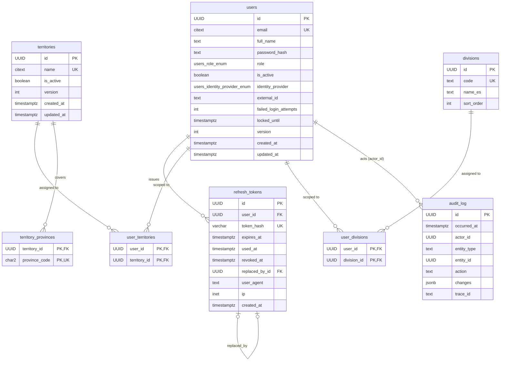

# Data Model Documentation

This document describes the data model of the Quermed CRM as implemented in PostgreSQL 16 through SQLAlchemy models (`backend/app/infrastructure/db/models/`) and Alembic migrations (`backend/alembic/versions/`). It covers entity descriptions, field definitions, validation rules, relationships and an entity-relationship diagram.

Common conventions:

- Every table has a `id` UUID primary key (UUIDv7, generated by the application).
- Mutable aggregates carry `created_at`, `updated_at` (timestamptz, server defaults) and `version` (integer, starts at 1) for optimistic locking (`If-Match` header).
- Case-insensitive uniqueness uses the `citext` extension.
- Enumerations are PostgreSQL `ENUM` types named `<table>_<column>_enum`.

## Model Descriptions

### 1. User
A person who can log in: sales rep, sales manager, back office or administrator.

**Fields:**
- `id`: Unique identifier (Primary Key)
- `email`: Login identity, `citext`, unique (case-insensitive)
- `full_name`: Displayed as "Comercial" on records and reports
- `password_hash`: argon2id hash; null for future SSO-only users
- `role`: `users_role_enum` — `sales_rep | sales_manager | back_office | admin`
- `is_active`: Deactivated users cannot log in and their tokens are rejected (default `true`)
- `identity_provider`: `users_identity_provider_enum` — `password | entra_id` (default `password`)
- `external_id`: Identifier at the external identity provider (optional)
- `failed_login_attempts`: Consecutive failed logins (default 0)
- `locked_until`: Lockout expiry after 10 consecutive failures (optional)
- `version`, `created_at`, `updated_at`: Common columns

**Validation Rules:**
- Email must be a valid address; uniqueness is case-insensitive
- Password policy: at least 12 characters (enforced by the domain, only the hash is stored)
- An administrator cannot deactivate or demote their own account
- `(identity_provider, external_id)` is unique when `external_id` is set

**Relationships:**
- `territory_links`: One-to-many with UserTerritory (scope)
- `division_links`: One-to-many with UserDivision (scope)
- `refresh_tokens`: One-to-many with RefreshToken
- Referenced by AuditLog as `actor_id`

### 2. RefreshToken
A rotating refresh token issued at login; only its SHA-256 hash is stored.

**Fields:**
- `id`: Unique identifier (Primary Key)
- `user_id`: Foreign key to User (`ON DELETE RESTRICT`)
- `token_hash`: SHA-256 hex digest, unique (max 128 characters)
- `expires_at`: Expiry (30 days after issue)
- `used_at`: Set when rotated; reuse of a used token revokes the whole family
- `revoked_at`: Set on logout, password change, deactivation or reuse detection
- `replaced_by_id`: The token issued at rotation (self reference, `ON DELETE SET NULL`)
- `user_agent`, `ip`: Client information for support (optional, `inet` for `ip`)
- `created_at`: Issue time

**Validation Rules:**
- A token is usable only when `used_at` and `revoked_at` are null and `expires_at` is in the future

**Relationships:**
- `user`: Many-to-one with User
- `replaced_by`: Self reference to the successor token

### 3. Territory
A geographic sales territory made of Spanish provinces.

**Fields:**
- `id`: Unique identifier (Primary Key)
- `name`: `citext`, unique (case-insensitive), max 100 characters
- `is_active`: Inactive territories cannot be assigned (default `true`)
- `version`, `created_at`, `updated_at`: Common columns

**Validation Rules:**
- A territory with active users assigned cannot be deactivated (`territory_in_use`)

**Relationships:**
- `province_links`: One-to-many with TerritoryProvince (cascade delete)
- Referenced by UserTerritory

### 4. TerritoryProvince
Membership of a province in a territory.

**Fields:**
- `territory_id`: Foreign key to Territory (`ON DELETE CASCADE`), part of the primary key
- `province_code`: INE two-digit code `01`–`52`, part of the primary key

**Validation Rules:**
- `province_code` must match `^(0[1-9]|[1-4][0-9]|5[0-2])$` (check constraint)
- A province belongs to at most one territory (unique constraint on `province_code`) — this is what allows an account's province to resolve its territory automatically

**Relationships:**
- `territory`: Many-to-one with Territory

### 5. Division
Product division (reference data seeded by `app/infrastructure/db/seed.py`; seven rows with stable ids).

**Fields:**
- `id`: Unique identifier (Primary Key, deterministic UUIDv5 per code)
- `code`: `assisted_reproduction | consumables | gynaecology | vascular | neurology | equipment | carts_and_arms`, unique
- `name_es`: Spanish display name
- `sort_order`: Display order

**Relationships:**
- Referenced by UserDivision

### 6. UserTerritory
Assignment of a territory to a user (scope).

**Fields:**
- `user_id`: Foreign key to User (`ON DELETE CASCADE`), part of the primary key
- `territory_id`: Foreign key to Territory (`ON DELETE RESTRICT`), part of the primary key

### 7. UserDivision
Assignment of a division to a user (scope).

**Fields:**
- `user_id`: Foreign key to User (`ON DELETE CASCADE`), part of the primary key
- `division_id`: Foreign key to Division (`ON DELETE RESTRICT`), part of the primary key

### 8. AuditLog
Append-only record of every audited mutation.

**Fields:**
- `id`: Unique identifier (Primary Key)
- `occurred_at`: When the event happened
- `actor_id`: The user who acted (nullable for anonymous/system events, e.g. failed login for an unknown email)
- `entity_type`: `user`, `territory`, … 
- `entity_id`: The affected record (nullable)
- `action`: Dotted event name, e.g. `user.created`, `user.scope_changed`, `auth.login_failed`, `territory.updated`
- `changes`: `jsonb` map of `field → { before, after }`; `password_hash` and `token_hash` are always `"[redacted]"`
- `trace_id`: Request trace id for support

**Validation Rules:**
- Rows are never updated or deleted by the application; the `crm_app` database role has only `SELECT, INSERT` on this table
- Written in the same transaction as the data it describes (unit of work)

**Relationships:**
- `actor`: Many-to-one with User (no foreign key, so audit survives user changes)

## Entity Relationship Diagram

## Indexes

| Table | Index | Purpose |
|---|---|---|
| `users` | `users_email_key` (unique), `ix_users_role`, `ix_users_is_active`, `uq_users_provider_external_id` | login lookup, list filters, SSO identity |
| `refresh_tokens` | `refresh_tokens_token_hash_key` (unique), `ix_refresh_tokens_user_id`, `ix_refresh_tokens_expires_at` | token lookup, revocation per user, expiry cleanup |
| `territories` | `territories_name_key` (unique) | name uniqueness |
| `territory_provinces` | PK `(territory_id, province_code)`, `uq_territory_provinces_province_code` | one territory per province |
| `audit_log` | `ix_audit_log_entity (entity_type, entity_id, occurred_at DESC)`, `ix_audit_log_actor (actor_id, occurred_at DESC)`, `ix_audit_log_occurred_at (occurred_at DESC)` | audit timeline per entity/actor |

## Key Design Principles

1. **Scope is data**: territories (provinces) and divisions are assigned to users; later changes filter business records with the same scope at SQL level.
2. **Optimistic locking**: every mutable aggregate carries `version`; concurrent edits fail with `409` instead of silently overwriting.
3. **Audit in the same transaction**: audit rows and data changes commit together; the table is append-only for the application role.
4. **Provinces are code, not a table**: the 52 INE codes never change; a check constraint keeps the column honest.
5. **Reference data with stable ids**: divisions are seeded with deterministic UUIDs so environments never drift.

## Notes

- Migration `0001_foundation` (`backend/alembic/versions/20260827_2101_foundation.py`) creates the extension, enums, tables, indexes and the guarded grant on `audit_log`.
- The application role `crm_app` is created by the seed (`make seed`); in development the superuser `crm` from Docker Compose is used and the audit grant is only applied when the role exists.
